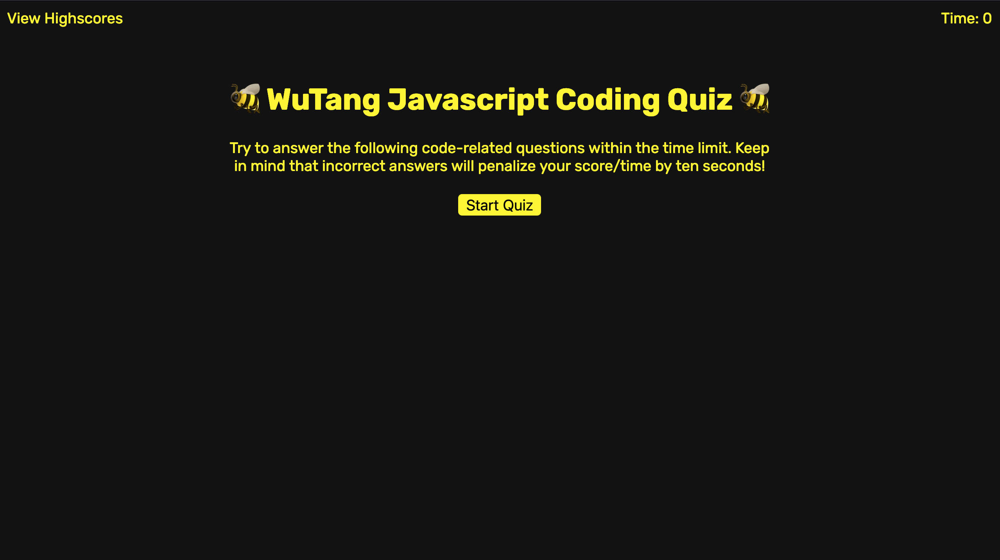

# Interactive Quiz

This Interactive Quiz is a timed quiz game designed to test your knowledge of Javascript concepts. The quiz consists of a series of multiple-choice questions, and each correct answer is awarded with points while incorrect answers are penalized with a deduction of time from the player's total time limit. 

## Table of Contents

- [Interactive Quiz](#interactive-quiz)
  - [Table of Contents](#table-of-contents)
  - [Getting Started](#getting-started)
  - [Gameplay](#gameplay)
  - [Highscores](#highscores)
  - [Credits](#credits)

## Getting Started

To start playing the game, simply open the `index.html` file in your web browser. The game should start automatically.

You can also follow [this link](https://drgunbot.github.io/Interactive-Game/index.html) to access the game in a live environment

## Gameplay

The WuTang Javascript Coding Quiz starts with a welcome screen that provides a brief overview of the rules and instructions for playing the game. The player can then click the "Start Quiz" button to begin the game.

Once the game starts, the player is presented with a series of multiple-choice questions, one at a time. The player must choose the correct answer within the given time limit to move on to the next question.

If the player chooses an incorrect answer, the game penalizes them by deducting time from their remaining time limit and they're sent to the 36 chambers of death, kid. But if they choose correctly, they are rewarded with points and Wutang's C.R.E.A.M

If the player answers all the questions correctly before the time limit runs out, they are taken to an end screen where they can enter their initials to save their score to a highscores list.

If the time limit runs out before the player answers all the questions, the game ends and the player is taken to the end screen where they can enter their initials to save their score to the highscores list.

## Highscores

The highscores list can be accessed by clicking the "View Highscores" link on the game's welcome screen or by navigating directly to the `highscores.html` file. The highscores list displays the initials and scores of all players who have completed the game and saved their score to the list.

The highscores list can be cleared by clicking the "Clear Highscores" button.

## Credits

The WuTang Javascript Coding Quiz was created by Sean Fox. The quiz questions were inspired by various online Javascript resources and tutorials.

